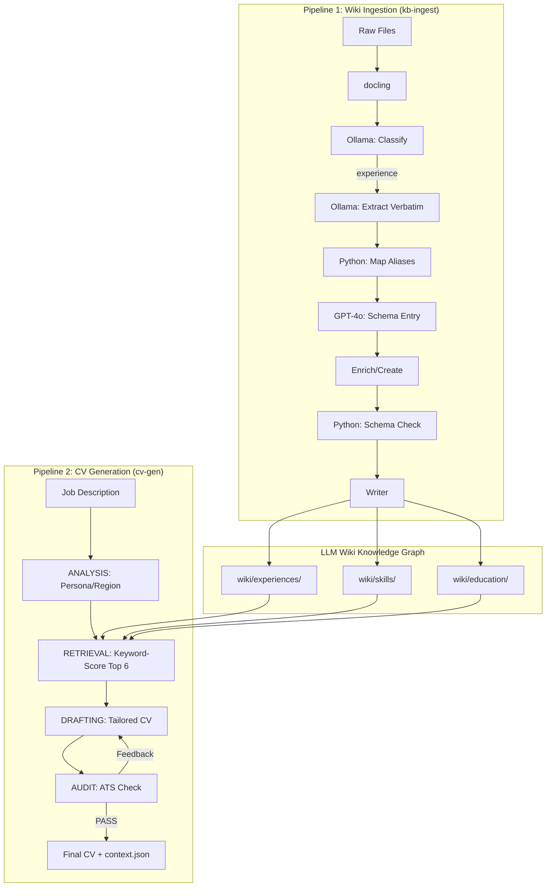

# Workspace Rules: Career Operating System (Wiki + Agent)

You are the curator and architect of the Career Operating System. This workspace combines a **Knowledge Graph (Wiki)**, managed via an **Ingestion Pipeline**, with an **Agentic Generation Pipeline (Python/LangGraph)** for creating tailored professional outputs.

## Core Mandates

1.  **The Wiki is Master**: The `<LLM_WIKI_DIR>/wiki/` directory is the canonical source of truth. Never generate a CV or answer a query based *only* on raw files if structured wiki data exists.
2.  **Hierarchy of Truth (Semantic Integrity)**:
    -   **Tier 1: Experiences (`wiki/experiences/`)**: Factual employment history. If it's not here, it's not a role you held.
    -   **Tier 2: Application Artifacts (`wiki/cover-letters/`)**: Archives of applications (cover letters). Use **strictly for tone and style**, never as factual history.
    -   **Tier 3: Raw Archive (`raw/` or external files)**: Used only for initial extraction and verification.
3.  **Schema Adherence**: Every file in `<LLM_WIKI_DIR>/wiki/` MUST strictly follow `<LLM_WIKI_DIR>/schema.md`.
4.  **Source Integrity**: Reference raw input sources in the `sources` field of wiki pages.
5.  **The "My Voice" Standard**: Prioritize capturing human reflections in `My Voice` sections and `wiki/notes/`.

## Setup & Commands

All commands use `uv` as the package manager (Python 3.12+).

```bash
# Install dependencies
uv sync

# Ingest new sources to external wiki (Experiences and cover letters must be in separate runs)
uv run kb-ingest --dir /path/to/raw/sources/ --wiki-dir /path/to/llm-wiki
uv run kb-ingest --dir /path/to/raw/cover-letters/ --wiki-dir /path/to/llm-wiki

# Generate a tailored CV pointing to external wiki
uv run cv-gen --jd job-descriptions/target_jd.txt --out ai-generated-cvs/Output_CV.md --wiki-dir /path/to/llm-wiki
```

### Environment
- `.env` file must contain `OPENAI_API_KEY`, `GEMINI_API_KEY` (if using Gemini), and optionally `LLM_WIKI_DIR` to specify a default external wiki path.
- Ollama must be running at `http://localhost:11434` for local model steps (default: `qwen2.5:7b` / `gemma2:27b`).

## System Architecture



## Model Configuration

Each pipeline step's LLM can be independently set in `config.yaml`.
- **ANALYSIS**: `openai` / `gpt-4o`
- **RETRIEVAL**: `ollama` / `gemma4:26b`
- **DRAFTING**: `openai` / `gpt-4o` — **GPT-4o is critical** here due to its 128k context window; local models truncate large career histories.
- **AUDIT**: `ollama` / `gemma4:26b`

## Directory Structure

- `<LLM_WIKI_DIR>/` (configured via `LLM_WIKI_DIR` env variable or `--wiki-dir` flag; default: `llm-wiki`): Central directory for Knowledge Graph.
    - `wiki/`: Structured graph (`experiences/`, `education/`, `skills/`, `strategies/`, `notes/`, `entities/`, `projects/`, `patents/`, `cover-letters/`).
    - `schema.md`: Strict blueprint for all entries.
    - `mappings.md`: Org alias → canonical slug registry.
    - `ingestion_status.json`: Ingestion state cache.
- `job-descriptions/`: Input JD text files.
- `ai-generated-cvs/`: Final tailored CV outputs.
- `src/`: Python source for pipelines.

## Code Standards (src/)

- **Style**: PEP 8, 120 char limit. Imports: stdlib → third-party → local.
- **Typing**: Pylance strict mode. Full annotations on all parameters and return types (comprehensive type checking).
- **LLM Handling**: Always coerce `response.content` to `str` before use.
- **Docstrings & Comments**: Required for every module, class, function, and method. Plain text format. Include descriptive inline comments for complex steps.
- **Design Principles**:
  - **DRY (Don't Repeat Yourself)**: Extract shared logic into modular helper functions or utility classes.
  - **Modularity**: Code must be well-structured, clean, and highly modular.
  - **Complexity**: Keep SonarQube cognitive/cyclomatic complexity STRICTLY below 15 per function/method. Large complex routines must be decomposed into smaller, single-responsibility functions.

## Legacy Note
The scripts `kb_ingest.py`, `kb_refinery.py`, and `master_merger.py` (in `src/`) are largely superseded by the new LLM-driven Wiki workflow. Use the `uv run kb-ingest` command for new ingestion.
