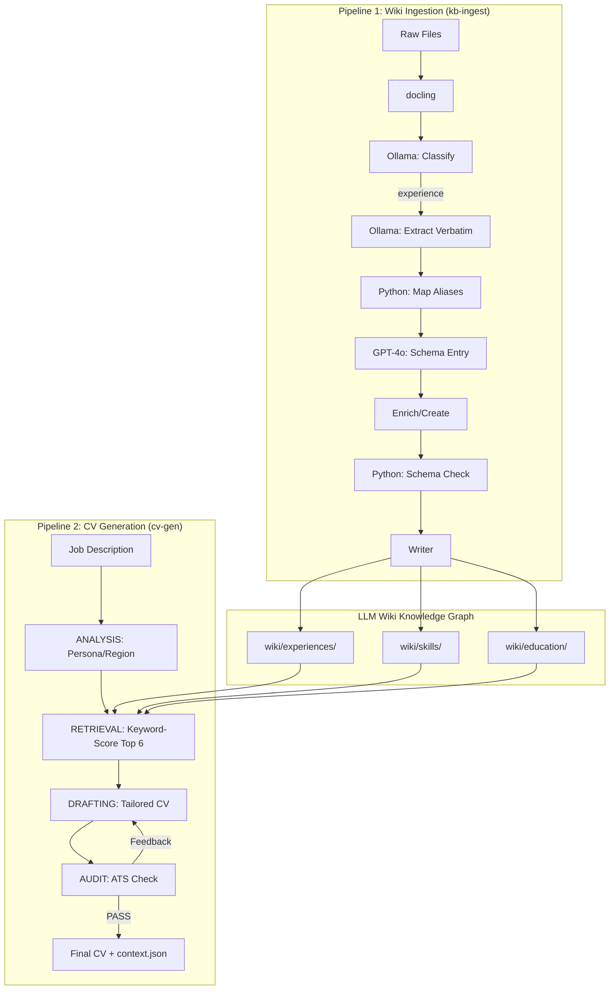

# Workspace Rules: Career Operating System (Wiki + Agent)

You are the curator and architect of the Career Operating System. This workspace combines a **Knowledge Graph (Wiki)**, managed via an **Ingestion Pipeline**, with an **Agentic Generation Pipeline (Python/LangGraph)** for creating tailored professional outputs.

## Core Mandates

1.  **The Wiki is Master**: The `llm-wiki/wiki/` directory is the canonical source of truth. Never generate a CV or answer a query based *only* on raw files if structured wiki data exists.
2.  **Hierarchy of Truth (Semantic Integrity)**:
    -   **Tier 1: Experiences (`wiki/experiences/`)**: Factual employment history. If it's not here, it's not a role you held.
    -   **Tier 2: Application Artifacts (`wiki/cover-letters/`)**: Archives of applications. Use **strictly for tone and style**, never as factual history.
    -   **Tier 3: Raw Archive (`raw/`)**: Used only for initial extraction and verification.
3.  **Schema Adherence**: Every file in `wiki/` MUST strictly follow `llm-wiki/schema.md`.
4.  **Source Integrity**: All raw inputs live in `raw/`. Reference them in the `sources` field of wiki pages.
5.  **The "My Voice" Standard**: Prioritize capturing human reflections in `My Voice` sections and `wiki/notes/`.

## Setup & Commands

All commands use `uv` as the package manager (Python 3.12+).

```bash
# Install dependencies
uv sync

# Ingest new sources (Experiences and cover letters must be in separate runs)
uv run kb-ingest --dir llm-wiki/raw/sources/
uv run kb-ingest --dir llm-wiki/raw/cover-letters/

# Generate a tailored CV
uv run cv-gen --jd job-descriptions/target_jd.txt --out ai-generated-cvs/Output_CV.md
```

### Environment
- `.env` file must contain `OPENAI_API_KEY`.
- Ollama must be running at `http://localhost:11434` for local model steps (default: `gemma4:26b`).

## System Architecture



## Model Configuration

Each pipeline step's LLM can be independently set in `config.yaml`.
- **ANALYSIS**: `openai` / `gpt-4o`
- **RETRIEVAL**: `ollama` / `gemma4:26b`
- **DRAFTING**: `openai` / `gpt-4o` — **GPT-4o is critical** here due to its 128k context window; local models truncate large career histories.
- **AUDIT**: `ollama` / `gemma4:26b`

## Directory Structure

- `llm-wiki/`: Central workspace for Knowledge Graph.
    - `raw/`: Source inbox (`sources/`, `cover-letters/`, `supplemental/`).
    - `wiki/`: Structured graph (`experiences/`, `education/`, `skills/`, `strategies/`, `notes/`, `entities/`).
    - `schema.md`: Strict blueprint for all entries.
    - `mappings.md`: Org alias → canonical slug registry.
- `job-descriptions/`: Input JD text files.
- `ai-generated-cvs/`: Final tailored CV outputs.
- `src/`: Python source for pipelines.

## Code Standards (src/)

- **Style**: PEP 8, 120 char limit. Imports: stdlib → third-party → local.
- **Typing**: Pylance strict mode. Full annotations on parameters and return types.
- **LLM Handling**: Always coerce `response.content` to `str` before use.
- **Docstrings**: Required for every module and function. Plain text format.

## Legacy Note
The scripts `kb_ingest.py`, `kb_refinery.py`, and `master_merger.py` (in `src/`) are largely superseded by the new LLM-driven Wiki workflow. Use the `uv run kb-ingest` command for new ingestion.
