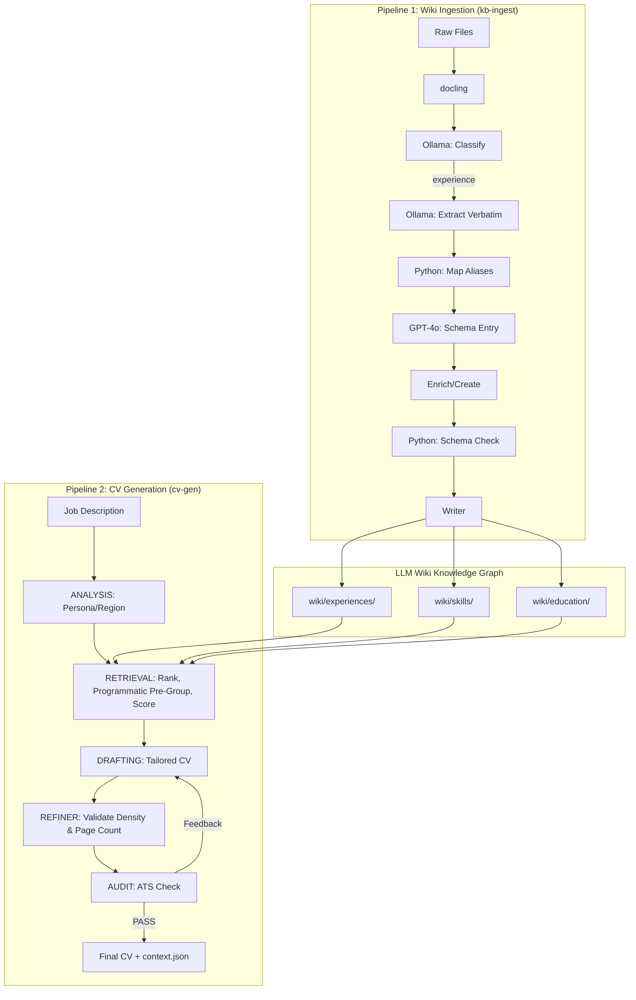

# Workspace Rules: Career Operating System (Wiki + Agent)

You are the curator and architect of the Career Operating System. This workspace combines a **Knowledge Graph (Wiki)**, managed via an **Ingestion Pipeline**, with an **Agentic Generation Pipeline (Python/LangGraph)** for creating tailored professional outputs.

## Core Mandates

1.  **The Wiki is Master**: The `<LLM_WIKI_DIR>/wiki/` directory is the canonical source of truth. Never generate a CV or answer a query based *only* on raw files if structured wiki data exists.
2.  **Hierarchy of Truth (Semantic Integrity)**:
    -   **Tier 1: Experiences (`wiki/experiences/`)**: Factual employment history. If it's not here, it's not a role you held.
    -   **Tier 2: Application Artifacts (`wiki/cover-letters/`)**: Archives of applications (cover letters). Use **strictly for tone and style**, never as factual history.
    -   **Tier 3: Raw Archive (`raw/` or external files)**: Used only for initial extraction and verification.
3.  **Schema Adherence**: Every file in `<LLM_WIKI_DIR>/wiki/` MUST strictly follow `<LLM_WIKI_DIR>/schema.md`.
4.  **Source Integrity**: Reference raw input sources in the `sources` field of wiki pages.
5.  **The "My Voice" Standard**: Prioritize capturing human reflections in `My Voice` sections and `wiki/notes/`.

## Setup & Commands

All commands use `uv` as the package manager (Python 3.12+).

```bash
# Install dependencies
uv sync

# Ingest new sources to external wiki (Experiences and cover letters must be in separate runs)
uv run kb-ingest --dir /path/to/raw/sources/ --wiki-dir /path/to/llm-wiki
uv run kb-ingest --dir /path/to/raw/cover-letters/ --wiki-dir /path/to/llm-wiki

# Generate a tailored CV pointing to external wiki
uv run cv-gen --jd job-descriptions/target_jd.txt --out ai-generated-cvs/Output_CV.md --wiki-dir /path/to/llm-wiki
```

### Environment
- `.env` file must contain `OPENAI_API_KEY`, `GEMINI_API_KEY` (if using Gemini), and optionally `LLM_WIKI_DIR` to specify a default external wiki path.
- Ollama must be running at `http://localhost:11434` for local model steps (default: `qwen2.5:7b` / `gemma2:27b`).

## System Architecture



## Model Configuration

Each pipeline step's LLM can be independently set in `config.yaml`.
- **ANALYSIS**: `openai` / `gpt-4o`
- **RETRIEVAL**: `ollama` / `gemma4:26b`
- **DRAFTING**: `openai` / `gpt-4o` — **GPT-4o is critical** here due to its 128k context window; local models truncate large career histories.
- **AUDIT**: `ollama` / `gemma4:26b`

## Directory Structure

- `<LLM_WIKI_DIR>/` (configured via `LLM_WIKI_DIR` env variable or `--wiki-dir` flag; default: `llm-wiki`): Central directory for Knowledge Graph.
    - `wiki/`: Structured graph (`experiences/`, `education/`, `skills/`, `strategies/`, `notes/`, `entities/`, `projects/`, `patents/`, `cover-letters/`).
    - `schema.md`: Strict blueprint for all entries.
    - `mappings.md`: Org alias → canonical slug registry.
    - `ingestion_status.json`: Ingestion state cache.
- `job-descriptions/`: Input JD text files.
- `ai-generated-cvs/`: Final tailored CV outputs.
- `src/`: Python source for pipelines.

## Code Standards (src/)

- **Style**: PEP 8, 120 char limit. Imports: stdlib → third-party → local.
- **Typing**: Pylance strict mode. Full annotations on all parameters and return types (comprehensive type checking). Use generic type aliases and standard collection types (e.g., `list[str]`, `dict[str, Any]`, `str | None`).
- **File Length & Structure Limits**:
  - No single Python source file should exceed **500 lines** to maintain readability and ease of maintenance.
  - Large modules or graphs (e.g., `kb_ingest_graph.py`) must be decomposed into dedicated package subdirectories (e.g., `src/ingestion/`) with separated files:
    - `state.py` (State definition & Pydantic schemas)
    - `prompts.py` (Prompt templates & externalized instructions)
    - `nodes.py` (Functional implementation of graph nodes)
    - `graph.py` (Orchestration & compiler)
- **LLM Prompt Externalization**: Keep long system prompts and user templates separated from Python logic. Load prompts from external `.txt`, `.md`, or `.yaml` files in `src/prompts/` at runtime where applicable.
- **Ruff Linting & Formatting**: Enforce strict linting and automatic code formatting with `Ruff`. Run Ruff before committing or testing to ensure maximum cleanliness.
- **Error Handling & Fallbacks**: Implement explicit, typed error catching for all external APIs and LLM calls. Always define reliable model fallbacks (e.g., failing over to local Ollama models on API timeouts) and raise custom descriptive exceptions.
- **LLM Handling**: Always coerce `response.content` to `str` before use.
- **Docstrings & Comments**: Required for every module, class, function, and method. Plain text format. Include descriptive inline comments for complex steps.
- **Design Principles**:
  - **DRY (Don't Repeat Yourself)**: Extract shared logic into modular helper functions or utility classes.
  - **Modularity**: Code must be well-structured, clean, and highly modular.
  - **Complexity & Cognitive Load (SonarQube python:S3776 translation)**: Keep SonarQube cognitive/cyclomatic complexity STRICTLY below 15 per function/method. Cognitive Complexity measures how difficult the control flow of a function is for a human to follow. Every control structure (`if`, `elif`, `else`, `for`, `while`, `except`, etc.) and sequence of logical operators (`and`, `or`, `not`) increments the complexity score, and nesting multiplies this cost exponentially (each level of nesting adds a penalty of +1 on top of the structural increment). Follow these strict, non-negotiable prescriptions to keep code simple:
    - **Limit Nesting to Max 2 Levels**: Never nest control structures (loops, conditionals, try-except blocks) deeper than 2 levels. If a block requires more nesting, extract the inner block into a dedicated helper function.
    - **Enforce Return-Early / Guard Clauses**: Use guard clauses at the beginning of functions to handle errors, empty states, or edge cases and return early (`if not data: return {}`). This completely flattens the code flow and eliminates nested `if/else` hierarchies.
    - **Short, Single-Responsibility Functions (Max 30 Lines)**: Keep functions extremely focused. Ideally, a function should be under 30 lines of code. If a function is longer, decompose it into sequential steps, treating the parent function as an orchestrator that calls atomic helpers.
    - **Simplify Boolean Conditions & Operators**: Do not chain multiple logical operators (`and`, `or`, `not`) in a single condition, as SonarQube increments complexity for every chain. Instead, extract complex logical checks into descriptive boolean helper functions (e.g., `_is_valid_payload(...)`) or break compound checks into separate guard clauses.
    - **Avoid Reluctant/Greedy Regex Complexities**: For parsing, prefer clean, line-by-line string manipulations (like `split()`, `partition()`, `strip()`) or direct checks rather than complex, nested regular expressions which can trigger readability warnings (e.g. `python:S6019`).
    - **Avoid Recursive Complexity**: Prefer iterative approaches or simple linear flows over recursion. Recursion breaks linear control flow and heavily penalizes Cognitive Complexity.
  - **Deterministic Testing**: Write unit tests for core helpers and node functions. Mock external LLM and database operations using unit testing mocks or standard fixtures to guarantee fast, offline, and predictable tests.
- **Logging and Console Output**:
  - **Helper Modules, Graph Nodes, and Libraries**: Use standard Python logging with module-level loggers:
    ```python
    import logging
    logger = logging.getLogger(__name__)
    ```
    Always log system messages (events, operations, debug details) through `logger.info()`, `logger.warning()`, `logger.exception()`, etc. Never use raw `print()` statements here, and never call `logging.basicConfig()` inside libraries, as it overrides the importing CLI's logging configurations.
  - **CLI Entrypoint/Command Scripts** (e.g., `src/generate_cv.py`, `src/kb_ingest.py`, `src/kb_cleanup.py`):
    - May configure the root logger (via `logging.basicConfig`) in `main()` or the `if __name__ == "__main__":` block.
    - May use `print()` statements adorned with emojis (🚀, ✅, ❌, 📦, 🧹, ✨) *exclusively* for highly legible, user-facing console interactions and progress reporting.


## Legacy Note
The scripts `kb_ingest.py`, `kb_refinery.py`, and `master_merger.py` (in `src/`) are largely superseded by the new LLM-driven Wiki workflow. Use the `uv run kb-ingest` command for new ingestion.
