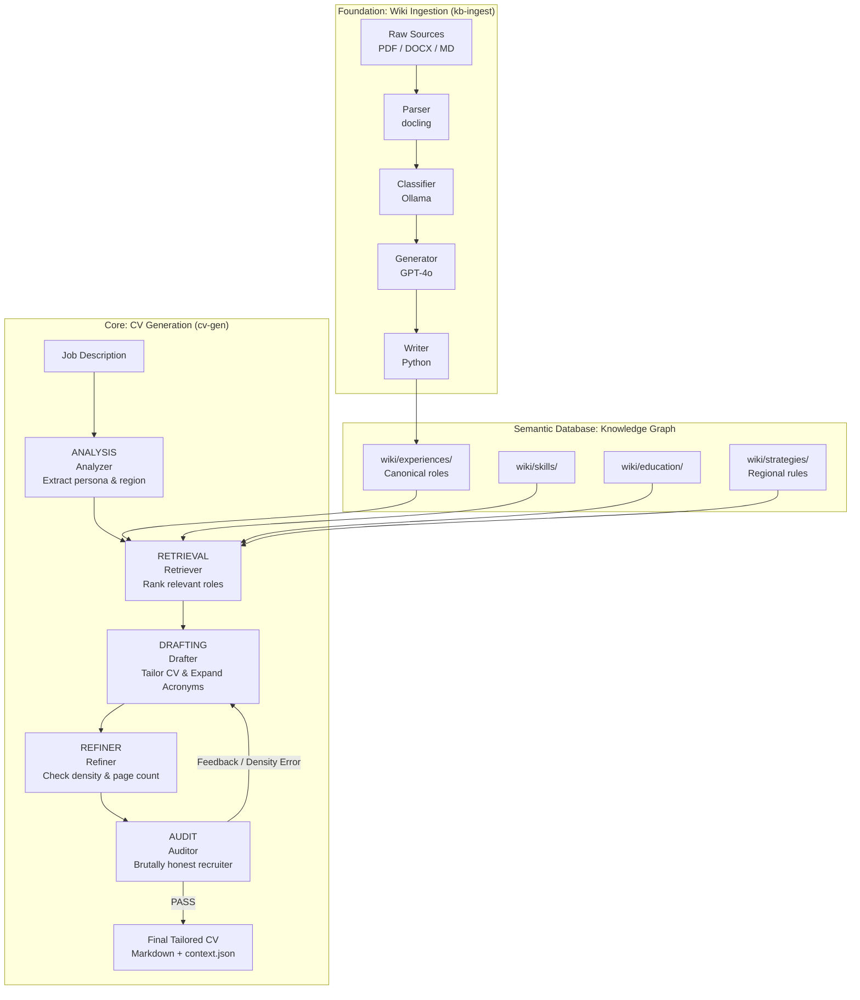

# CareerOS: Agentic CV Generator

CareerOS is an AI-powered engine designed to generate high-fidelity, ATS-optimized, and professionally tailored CVs. It uses an **Agentic LangGraph Pipeline** fueled by a **Structured Knowledge Graph** (Semantic Database) to synthesize career history into high-impact documents in seconds.

## The Core Value Proposition

1.  **Agentic Synthesis**: A multi-node pipeline that simulates a master executive writer and a brutally honest recruiter to tailor your experience to any job description.
2.  **Semantic Truth**: Every generated line is grounded in a canonical Knowledge Graph, ensuring 100% factual accuracy with zero hallucination.
3.  **Regional Intelligence**: Dynamic strategies that automatically adjust tone, section order, and formatting for target markets (e.g., EU, USA, UK).

## System Architecture

CareerOS is built on the principle that your career is a dataset, not a static document.



---

## 🚀 Quick Start

### 1. Installation
CareerOS uses `uv` for lightning-fast dependency management.

```bash
git clone https://github.com/your-repo/careeros
cd careeros
uv sync
```

### 2. Configuration
Copy the example environment file and add your API keys.

```bash
cp .env.example .env
```
*Required: `OPENAI_API_KEY` for high-fidelity drafting. Local models (Ollama) can be used for supporting steps.*

### 3. Initialize Your Knowledge Graph
The `llm-wiki/` directory is your system's semantic database. Populate it by ingesting your existing CVs or certificates.

```bash
# Ingest career history from existing documents
uv run kb-ingest --dir llm-wiki/raw/sources/
```

### 4. Generate a Tailored CV
Point the generator at a Job Description text file and specify an output path.

```bash
uv run cv-gen --jd job-descriptions/target_jd.txt --out outputs/My_Tailored_CV.md
```

---

## 🧠 The Semantic Database (LLM-Wiki)

CareerOS treats your professional history as a queryable graph stored in `llm-wiki/`. This structure allows the LLM to understand the *relationships* between your skills, organizations, and specific achievements.

### Data Tiers
1.  **Experiences (`wiki/experiences/`)**: Structured records of professional roles (The Source of Truth).
2.  **Skills (`wiki/skills/`)**: Technical and soft skills mapped to specific career evidence.
3.  **Strategies (`wiki/strategies/`)**: Regional tailoring rules (e.g., Dutch directness vs. US brevity).

---

## 🛠️ Generator Node Roles

*   **Analyzer:** Deconstructs the JD to identify the target persona and region.
*   **Retriever:** Scans the Knowledge Graph, ranks relevant entries, and loads strategy rules.
*   *   **Drafter:** A high-fidelity executive writer that applies acronym expansion and aggressive quantification.
*   **Refiner:** Validates document density to ensure professional layout.
*   **Auditor:** Acts as a **Brutally Honest Senior Recruiter**, hunting for weak metrics or "fluff."

---

## 💡 Background & Motivation

CareerOS was created to solve the "Tailoring Paradox": the more experience you have (e.g., 20+ years), the harder it is to surgically compress that history into a high-impact, 2-page document for a specific role. By moving from static documents to a **Semantic Database**, we enable an AI agent to perform this synthesis with a level of precision and speed that is impossible for humans.
