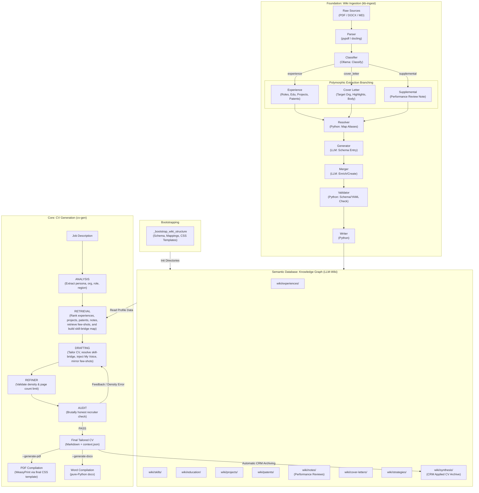

# CareerOS: Agentic CV Generator

CareerOS is an AI-powered engine designed to generate high-fidelity, ATS-optimized, and professionally tailored CVs. It uses an **Agentic LangGraph Pipeline** fueled by a **Structured Knowledge Graph** (Semantic Database) to synthesize career history into high-impact documents in seconds.

## The Core Value Proposition

1.  **Agentic Synthesis**: A multi-node pipeline that simulates a master executive writer and a brutally honest recruiter to tailor your experience to any job description.
2.  **Semantic Truth**: Every generated line is grounded in a canonical Knowledge Graph, ensuring 100% factual accuracy with zero hallucination.
3.  **Regional Intelligence**: Dynamic strategies that automatically adjust tone, section order, and formatting for target markets (e.g., EU, USA, UK).

## System Architecture

CareerOS is built on the principle that your career is a dataset, not a static document.



---

## Ingestion Pipeline Key Features

To maintain structural integrity and high ingestion speeds, `kb-ingest` employs:
*   **Dual PDF Parsing Strategy**: Digital PDFs are parsed using `pypdf`, preserving exact horizontal alignment of dates and text while reducing processing time by 100x. Scanned PDFs fallback dynamically to OCR via `docling`.
*   **Insensitive Entity Matching**: The mapping engine normalizes and slugifies both source organization names and aliases in `mappings.md` to avoid duplicate file creation due to formatting mismatches.
*   **Date-Bound Merging**: Unrelated roles at the same company (based on start date discrepancy) are correctly saved into separate time-bound files rather than being merged.
*   **Self-Healing YAML Validator**: Auto-cleans inline comments or annotations appended to YAML frontmatter fields by LLMs, ensuring strict parse compliance.

---

## Generation Pipeline Key Features

To ensure a perfectly structured, compact, and compliant CV, the generation pipeline utilizes:
*   **Dynamic 10-Year Boundary Calculation**: Old roles are dynamically determined based on `current_year - 10` (e.g., 2016 or earlier when running in 2026), replacing any hardcoded year limits.
*   **Deterministic Programmatic Pre-Grouping**: Multiple historical roles at the same company (e.g., historical Intel tenures) are programmatically consolidated in Python into a single combined entry *before* any LLM compression or drafting occurs.
*   **Nested Grouped Compression**: Consolidated company groups are compressed using a specialized LLM instruction (`compress_grouped_experience.txt`) to produce a beautifully nested Markdown list layout with 1-line impact summaries for each role, guaranteeing a clean and space-efficient timeline under tight page constraints.

---

## 🚀 Quick Start

### 1. Installation
CareerOS uses `uv` for dependency management.

```bash
git clone https://github.com/bvrabete/career-os
cd career-os
uv sync
```

### 2. Configuration
Copy the example environment file and add your API keys.

```bash
cp .env.example .env
```
*Required: `OPENAI_API_KEY` for high-fidelity drafting. Local models (Ollama) can be used for supporting steps.*

### 3. Initialize & Bootstrap Your Knowledge Graph
The Knowledge Graph (LLM-Wiki) is fully externalized. You can host it in any directory on your machine by setting the `LLM_WIKI_DIR` env variable or passing the `--wiki-dir` parameter. 

When you run ingestion against an empty or missing directory, CareerOS automatically **bootstraps** the whole structure for you:
- Creates all 14 standard wiki folders (`experiences`, `education`, `projects`, `skills`, `patents`, `notes`, etc.).
- Seeds a clean, candidate-anonymous `schema.md` blueprint.
- Seeds a clean `mappings.md` template for entity resolving and organization aliases.
- Pre-seeds a customization folder at `<LLM_WIKI_DIR>/templates/` with your default CSS stylesheets.

```bash
# Ingest career history from raw files to your external wiki
uv run kb-ingest --dir /path/to/raw/sources/ --wiki-dir /path/to/my-external-wiki
```

### 4. Generate a Tailored CV
Point the generator at a Job Description text file and specify your external wiki.

#### 🗂️ Zero-Config Default (Highly Recommended)
By default, you do not need to specify an output file! If you omit the `--out` argument, CareerOS automatically saves the frontmatter-tracked, CRM-ready Markdown CV directly into your external wiki's synthesis folder (`<LLM_WIKI_DIR>/wiki/synthesis/synthesis-cv-{company}-{role}-{date}.md`), keeping your workspace clean and logging your application history:

```bash
uv run cv-gen --jd job-descriptions/target_jd.txt --wiki-dir /path/to/my-external-wiki
```

If you append `--generate-pdf` or `--generate-docx`, it will compile a clean PDF or Word (.docx) document alongside the Markdown file inside the same synthesis folder, while dynamically filtering out raw tracking frontmatter headers so your resume remains perfectly professional.

#### 💾 Custom File Output
If you want to write a clean Markdown CV to a specific file outside of your LLM-Wiki, pass the `--out` parameter:

```bash
uv run cv-gen --jd job-descriptions/target_jd.txt --out outputs/My_Tailored_CV.md --wiki-dir /path/to/my-external-wiki --generate-pdf --generate-docx
```
*(When `--out` is specified, a backup duplicate copy is still archived under your wiki synthesis folder automatically for tracking, and a context JSON file is saved adjacent to the custom output for debugging).*

### 5. Advanced CLI Strategy, PDF & Word Compilation
The generation pipeline supports direct override of region strategy selection, and automatic production-ready PDF or Word document compilation:
*   `--strategy <slug>`: Force-bypasses the analyzer LLM's target region inference and enforces the specified regional strategy (e.g. `ireland`, `emea`, `nl_modern`).
*   `--generate-pdf`: Compiles a beautifully styled PDF directly from the final tailored markdown using the regional strategy's designated CSS stylesheet via WeasyPrint.
*   `--generate-docx`: Compiles a highly compatible and cleanly structured Word document (`.docx`) from the final tailored markdown using `python-docx` (100% OS-independent, requiring zero external system binaries).

---

## ⚙️ Model & Pipeline Configuration (`config.yaml`)

CareerOS features a fully programmable model-routing architecture defined in `config.yaml`. You can customize which LLM (local Ollama, Google Gemini, or OpenAI) handles each node of the ingestion and generation pipelines.

### 💻 Local Ollama Installation & Setup

To run local models, you must first install Ollama:

1. **Download & Install**: Visit [Ollama's Official Website](https://ollama.com) or install directly on Linux/macOS via terminal:
   ```bash
   curl -fsSL https://ollama.com/install.sh | sh
   ```
2. **Start the Server**: Ensure the Ollama server is running locally (by default it runs on `http://localhost:11434`).
3. **Pull the Required Models**: Run the following commands to pull the exact models used in the active configuration:
   ```bash
   # General fast operations, scoring, and classification (8B parameters)
   ollama pull llama3.1:8b

   # Light, ultra-fast intent analyzer and parser (7B parameters)
   ollama pull qwen2.5:7b
   ```

---

### 🎨 Available Configuration Templates

We provide several predefined configurations tailored for different hardware setups:

1. **`config.yaml` (Active Default / Low VRAM Local-First)**: 
   Optimized specifically to run **100% on GPU under 6GB VRAM**. By using `llama3.1:8b` and `qwen2.5:7b`, it completely avoids slow CPU offloading, making local execution near-instantaneous. Heavy drafting is offloaded to OpenAI's `gpt-4o` (which handles >30k token contexts effortlessly).
2. **`config.hybrid-openai.yaml` (Cloud-Assisted OpenAI Hybrid)**:
   A high-speed, high-precision layout pairing local Ollama models with OpenAI APIs (`gpt-4o` and `gpt-4o-mini`) for intensive parsing, drafting, and deduplication tasks.
3. **`config.hybrid-gemini.yaml` (Cloud-Assisted Gemini Hybrid)**:
   A fast, high-context layout pairing local Ollama models with Google Gemini APIs (`gemini-1.5-flash` and `gemini-1.5-pro`) for extensive drafting and schema-extraction tasks.
4. **`config.original-heavy.yaml` (High-End Local)**:
   The original model setup utilizing high-parameter local models (`qwen2.5:14b` and `gemma2:27b`) for high-reasoning local matching. Recommended only if you have 16GB+ VRAM or a dedicated cluster.

*To activate an alternative setup, simply overwrite `config.yaml` with your chosen template (e.g., `cp config.hybrid-openai.yaml config.yaml`).*

---

## 🧪 Testing & Continuous Integration (CI)

CareerOS includes a comprehensive test suite to ensure the stability and correctness of the ingestion, retrieval, scoring, and drafting nodes.

### Running Tests Locally

You can run the unit test suite locally using `uv`:

```bash
uv run python tests/test_pipeline.py
```

### GitHub Actions CI Pipeline

A GitHub Actions CI workflow is configured in `.github/workflows/test.yml`. It runs automatically on every `push` and `pull_request` to the `main` or `master` branches, performing the following steps:
1. Checks out the repository.
2. Installs `uv` using the official `astral-sh/setup-uv` action with dependency caching enabled.
3. Sets up a Python 3.12 environment.
4. Syncs project dependencies.
5. Runs the unit test suite to verify pipeline nodes, regex word boundary matching, few-shot retrieval, and skill-bridging logic.

### 🚫 Preventing PR Merges on Test Failure

To enforce high quality standards and prevent merging buggy code or unverified changes, configure branch protection rules in GitHub:
1. Go to your repository on GitHub.
2. Navigate to **Settings** -> **Branches**.
3. Under **Branch protection rules**, click **Add branch protection rule** (or edit your existing rule for `main`/`master`).
4. Set the **Branch name pattern** to `main` (or your default branch name).
5. Check **Require status checks to pass before merging**.
6. In the search box, search for **Run Unit Tests** and check it as a required status check.
7. Click **Create** or **Save changes** at the bottom of the page.

Now, GitHub will block any Pull Request from merging unless all unit tests pass successfully.

---

## 🧠 The Semantic Database (LLM-Wiki Graph)

CareerOS treats your professional history as a queryable graph. By defining the `LLM_WIKI_DIR` environment variable, your database is decoupled from this engine, allowing you to run it against multiple independent career graphs safely.

### Structured Graph Layout (under `<LLM_WIKI_DIR>/wiki/`)
1. **Experiences (`wiki/experiences/`)**: Canonical, structured records of professional roles (The Source of Truth).
2. **Projects & Patents (`wiki/projects/`, `wiki/patents/`)**: Standalone, reusable technical accomplishments, cross-linked back to experiences via frontmatter (e.g., `organization: [[intel-corporation]]`).
3. **Skills & Languages (`wiki/skills/`)**: Deep capabilities and languages, referencing specific experience nodes where they were demonstrated.
4. **Strategies (`wiki/strategies/`)**: Regional tailoring profiles containing localized bio copy, relocation rules, and style guidelines (e.g., Dutch directness vs. US brevity).
5. **Notes (`wiki/notes/`)**: Peer praise, performance reviews (`tags: ["performance-review"]`), and subjective reflections which are dynamically injected to enrich descriptions and enforce the **"My Voice" Standard**.
6. **Cover Letters (`wiki/cover-letters/`)**: Historical applications archived for style and tone consistency.

---

## 🎨 PDF & Stylesheet Customization

Decoupling the styles from the engine allows you to fully customize CV formatting for different industries or aesthetics.

### How Stylesheets are Bootstrapped
During directory initialization, standard CSS styles (`base.css`, `emea_tech.css`, `nl_modern.css`) are automatically copied into `<LLM_WIKI_DIR>/templates/`. 

- Because `<LLM_WIKI_DIR>/templates/` resides one level up from `wiki/`, it is completely ignored by the `kb-ingest` pipeline.
- You can freely edit, rename, or add new `.css` files directly in `<LLM_WIKI_DIR>/templates/`.

### Linking Styles to Regional Strategies
To apply a stylesheet to a regional profile, add the `pdf_template` attribute in the YAML frontmatter of your **Strategy Page** (e.g., `wiki/strategies/strategy-emea.md`):

```yaml
---
type: strategy
title: "EMEA Strategy"
region: [Ireland, Netherlands, Germany, USA]
pdf_template: "emea_tech.css"  # resolved directly to <LLM_WIKI_DIR>/templates/emea_tech.css
---
```

When you compile a CV with PDF generation enabled (`--generate-pdf`), the engine will automatically resolve the style name, searching:
1. Directly under `<LLM_WIKI_DIR>/`
2. Under your external `<LLM_WIKI_DIR>/templates/` (ideal for user customizations)
3. Under the engine repository's fallback `templates/` folder (standard templates)

---

## 🛠️ Generator Node Roles

*   **Analyzer:** Deconstructs the JD to identify the target persona, target organization, and region.
*   **Retriever:** Scans the Knowledge Graph, ranks relevant entries, and loads strategy rules.
    *   *Programmatic Pre-Grouping:* Programmatically identifies historical experiences (starting <= `current_year - 10`) belonging to the same organization, and merges them into a combined company entry to prevent redundant flat listings.
    *   *Nested Grouped Compression:* Compresses merged historical experiences using a specialized LLM node and a prompt designed for tight nesting, rendering a clean, multi-role indented timeline with single-line impact statements.
*   **Drafter:** A high-fidelity executive writer that applies acronym expansion, aggressive quantification, and regional profile tailoring.
*   **Refiner:** Validates document density and page limits, checking length constraints and adjusting formatting if necessary to guarantee professional layout presentation.
*   **Auditor:** Acts as a **Brutally Honest Senior Recruiter**, hunting for weak metrics, "fluff," or style violations, feeding constructive adjustments back into the pipeline.

---

## 💡 Background & Motivation

CareerOS was created to solve the "Tailoring Paradox": the more experience you have (e.g., 20+ years), the harder it is to surgically compress that history into a high-impact, 2-page document for a specific role. By moving from static documents to a **Semantic Database**, we enable an AI agent to perform this synthesis with a level of precision and speed that is impossible for humans.
