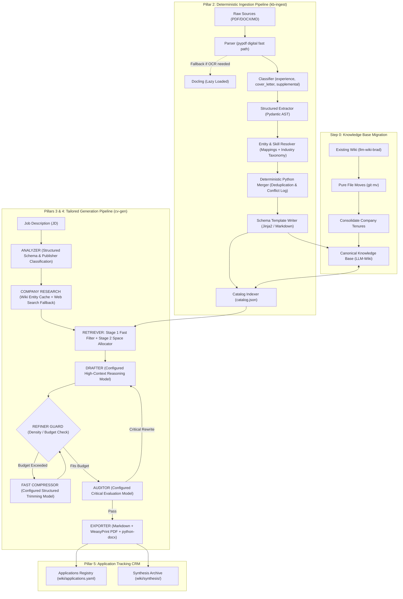

# CareerOS Architecture Blueprint & Implementation Roadmap

This document serves as the canonical architectural specification, gap analysis, and phased implementation roadmap for the **Career Operating System (CareerOS)**.

---

## 1. Executive Summary & Core Objectives

CareerOS is an AI-powered operating system for career knowledge management and tailored document generation. Its mission is to transform a candidate's complete professional record into an optimized, zero-hallucination, ATS-compliant CV tailored to any target Job Description (JD).

### Core Goals
1. **Semantic Truth**: Zero hallucinations. Every claim, date, metric, and achievement traces back directly to canonical Knowledge Base records.
2. **Cost & Latency Efficiency**: Eliminate sequential $O(N)$ LLM invocation loops across ingestion and retrieval.
3. **Multi-Model Orchestration**: Right model for the right job (fast/cheap models for extraction, filtering, and trimming; high-context/high-capability models for synthesis and auditing).
4. **Structured & Type-Safe Operations**: Replace fragile regex/markdown parsing with native Pydantic structured outputs and deterministic AST merging.
5. **Strict Page Budget Convergence**: Enforce page density (1-page or 2-page limits) prior to running expensive audit passes.

---

## 2. High-Level System Architecture



---

## 3. Pillar Specifications

### Pillar 1: Knowledge Base Model (Hierarchical Company Tenures)
- **Problem**: Historically, multi-role careers at the same company were split into disconnected files (`google-swe.md`, `google-lead.md`), requiring 300+ lines of fragile Python heuristics to re-assemble.
- **Specification**:
  - **The Total Recall Master Archive Principle**:
    - The Knowledge Base is **strictly unconstrained, exhaustive, and cumulative**.
    - It must record 100% of the candidate's historical accomplishments, minor operational wins, metrics, patents, and technical context over their lifetime, regardless of quantity.
    - Zero pre-filtering or length budgets in the wiki: Experience files are never limited by bullet quotas (a single tenure may contain 30–40+ achievements).
    - Dense roles organize achievements under logical thematic subheadings (`### Architecture & Systems`, `### Team Leadership`, `### Performance & Reliability`) with source document citations preserved.
  - **The Contiguous Tenure Principle**: A Company Tenure strictly represents a **contiguous, unbroken period of employment** at an organization. Progressive promotions, title changes, and lateral moves within that unbroken timeline belong in that tenure container.
  - **The Boomerang Stint Rule**: If a candidate leaves an organization to work elsewhere and later returns (a "boomerang" tenure), each contiguous period MUST remain a separate tenure record (e.g. `intel-platform-architect-and-tech-lead.md` for 2007–2017 and `intel-software-engineering-manager.md` for 2021–2023). Merging non-contiguous stints across an external employment gap is strictly prohibited, as it creates false continuous employment and breaks chronological ordering.
  - **The Concurrent Roles & Side Ventures Standard**:
    - **Schema Representation**: Roles and tenures must explicitly specify `employment_nature: "primary" | "side_venture" | "advisory"` and `employment_type: "full_time" | "part_time" | "co_founder" | "contract"`.
    - **Dynamic JD Posture (Analyzer)**: The Analyzer assesses company archetype (Enterprise vs. Startup/Innovation) and sets a posture: `"feature"` (flagship leadership proof), `"reframe"` (soften title to Technical Advisor / Co-Founder to remove moonlighting anxiety), or `"condense_or_omit"` (for conservative corporate compliance).
    - **Strategy-Driven Presentation Layout**: Regional Strategy dictates the structural rendering: `"inline_badged"` (interleaved in main chronology with explicit `[Venture / Advisory]` badges) or `"dedicated_section"` (moved to an "Entrepreneurial Ventures & Advisory" section to preserve a clean single-track corporate timeline).
    - **Intelligent Achievement Attribution**: Drafter filters bullets based on target level—showcasing hands-on architecture (e.g. Agentic AI, LangGraph, FHIR) for Architect/Tech Lead roles, and product/0-to-1 scaling for Executive/CTO roles.
  - **The Deep-Dive Case Studies Standard (`wiki/case-studies/`)**:
    - Detailed architectural problem/solution narratives and deep-dive achievements are decoupled from "voice" and stored in `wiki/case-studies/` (Tier 1 factual records) linked via `related: [[company-slug]]`.
    - When a target JD requires deep technical evidence (e.g. Kafka lag autoscaling, socket pooling), the Retriever pulls these case studies to provide the Drafter with exact engineering facts.
  - **The Patents & Technical Assets Standard (`wiki/patents/`)**:
    - **First-Class Asset Files**: Patents remain first-class, rich entities in `wiki/patents/{patent-id}.md` storing legal metadata (Patent ID, title, assignee organization, grant/filing dates, USPTO link, abstract, co-inventors, and skills).
    - **Explicit Employer & Tenure Links**: Bidirectionally linked to the employer:
      ```yaml
      # In wiki/patents/patent-us-10912283-b2.md:
      organization: [[intel]]
      tenure: [[intel-platform-architect-and-tech-lead]]
      ```
      ```yaml
      # In wiki/experiences/intel-platform-architect-and-tech-lead.md:
      patents: ["US-10912283-B2", "US-10977692-B2", ...]
      ```
    - **In-Situ Employer Integration**: The Drafter always synthesizes a punchy summary bullet inside the employer's work experience section (e.g. *"Granted 9 US/international patents in IoT and machine learning at Intel"*).
    - **Dynamic Dedicated Section**: If target role relevance (R&D, Principal Architect, AI Systems) and page budget permit, a standalone "Patents & Inventions" section is rendered.
    - **Relevance Scoring & Portfolio Compression**: When multiple patents exist, the Retriever scores them against target JD keywords, showcasing the top 2–3 most relevant patents by ID and title while compressing the remainder into an authoritative summary.
  - **The Publications & Academic Assets Standard (`wiki/publications/`)**:
    - **First-Class Academic Asset Files**: Papers, articles, and book chapters reside in `wiki/publications/{pub-slug}.md` storing DOI, publication type, venue, date, authors, peer review status, abstract, and skills.
    - **Bidirectional Employer & Education Links**: Links to the institution where the research took place:
      ```yaml
      organization: [[intel-corporation]]              # or university entity
      tenure: [[intel-platform-architect-and-tech-lead]] # or education: [[degree-slug]]
      ```
    - **Dynamic Presentation**: Highlighted in a dedicated "Selected Publications" section for academic/research/AI roles; folded concisely into the employer or university bullet points on space-constrained executive CVs.
  - Each contiguous employer stint is represented by a **Company Tenure** file (`wiki/experiences/{company}.md` or `{company}-{start_year}.md` for multiple stints).
  - **YAML Frontmatter**: Company slug, canonical organization name, overall tenure dates, employment type, location, and a list of progressive `roles`:
    ```yaml
    ---
    type: experience
    organization: "[[google]]"
    organization_name: "Google LLC"
    dates: { start: "2018-03-01", end: "2024-05-31" }
    employment_type: Permanent
    roles:
      - title: "Staff Software Engineer"
        dates: { start: "2021-06-01", end: "2024-05-31" }
        summary: "Platform technical lead..."
        key_achievements:
          - "Architected zero-downtime event streaming pipeline..."
        skills: [Go, Kubernetes, Kafka, Distributed Systems]
      - title: "Senior Software Engineer"
        dates: { start: "2018-03-01", end: "2021-05-31" }
        summary: "Core infrastructure engineer..."
        key_achievements:
          - "Optimized query latency by 45%..."
        skills: [Go, PostgreSQL, gRPC]
    ---
    ```
  - **Body Content**: Unconstrained human narrative, architectural context, challenges, leadership lessons, and "My Voice" reflections.

---

### Pillar 2: Ingestion Pipeline (`kb-ingest`)
- **Problem**: 3-tier sequential LLM calls per entity (Extract JSON $\rightarrow$ Generate MD $\rightarrow$ Merge MD) resulting in 20+ LLM calls per resume. Heavy `docling` package crashed imports when not installed.
- **Specification**:
  - **Lazy-Loaded Parser**: Fast digital text extraction via `pypdf` (<50ms). Docling is lazily imported *only* inside `_parse_via_docling` when OCR fallback is required and available. Non-ingest tools never load Docling.
  - **Single Extractor to Pydantic AST**: Structured output returns typed `ExtractedResume` containing `CompanyTenure`, `RoleEntry`, `EducationRecord`, `PatentRecord`, `ProjectRecord`.
  - **Entity Resolution**:
    - *Organizations*: Matched against `mappings.md` and `wiki/entities/`. High-confidence matches auto-link; novel/ambiguous names are flagged in a review queue.
    - *Skills*: Normalized via LLM industry understanding (e.g. "K8s" $\rightarrow$ "Kubernetes", "Postgres" $\rightarrow$ "PostgreSQL"), strictly without inventing skills not in the raw document.
  - **Deterministic Python Merging & Semantic Fusion**:
    - *Semantic Fusion (Best-of-Both)*: When an incoming bullet and an existing bullet describe the same underlying achievement (semantic similarity > 0.85), merge them into a single bullet that combines the most specific metrics, scale numbers, and technical context from both versions.
    - *Conflicting Metrics Resolution*: If overlapping achievements contain contradictory facts or numbers (e.g. 45% vs 30% latency reduction), display both side-by-side in the terminal for **immediate manual feedback** (`[1] Keep Existing`, `[2] Accept Incoming`, `[3] Fuse Custom Sentence`). If running non-interactively (CI/batch), retain the canonical wiki version and log to `wiki/conflicts.log`.
    - *Frontmatter Document Registry*: All contributing source files are recorded in the YAML frontmatter `sources: [...]` list, keeping the Markdown body clean, uncluttered, and readable.
    - *Evidence-Backed Normalized Skill Union*: Automatically union newly detected skills into frontmatter after alias normalization (via `mappings.md`), strictly requiring that every skill is backed by textual evidence in the verified achievements.
  - **Template Rendering**: Serializes canonical ASTs into Markdown using clean Jinja2/string templates.

---

### Pillar 3: Job Description Intelligence, Privacy Boundary & Relevance-First Retrieval
- **Core Mission**: **Maximize the suitability of the candidate profile for the target role.**
- **Specification**:
  - **ANALYZER Node (`models.ANALYSIS`)**:
    - Powered by a fast, structured JSON model configured in `config.yaml`.
    - Extracts the strongly-typed `JobAnalysis` schema: `target_role`, `seniority_level`, `must_have_skills`, `nice_to_have_skills`, `primary_ats_keywords`, `transferable_skills_map`, `domain_industry`, `company_archetype`, `locations`, and `side_venture_posture`.
    - **3-Way Publisher Classification**: Detects whether the JD is from a `direct_employer`, `agency_firm`, or `recruiter_individual`. Direct employer postings optimize for architectural depth and cultural mission; agency postings optimize for literal ATS keyword density and recruiter checklists.
  - **Candidate Privacy & Network Boundary**:
    - **Strict Offline Default**: Zero external web calls. Candidate career history, confidential patents, and personal notes NEVER leave the local environment or direct LLM API.
    - **Scoped Opt-In Web Research (`--enable-web-research`)**: Only if explicitly enabled, queries public target company info (business model, stack, engineering culture) and caches to `wiki/entities/{company_slug}.md`, strictly without transmitting any candidate data.
    - **Undisclosed Agency Handling**: If posted by an agency with an anonymous client, interactively prompts the user for the real company name. If provided, researches and caches; if skipped or headless, falls back gracefully to domain-level ATS mode.
  - **Relevance-First Knapsack Retrieval Engine**:
    - **Primary Dimension (Relevance Knapsack)**: Individual achievements are scored against JD requirements. High-relevance achievements are prioritized and retained regardless of tenure age, demonstrating long-term depth and sustained track record for core competencies. Low-relevance/routine duties (even in recent roles) are pruned first.
    - **Full-Fidelity Achievement Selector**: Operates strictly as a selector/filter rather than a lossy summarizer. It extracts the most relevant accomplishments in their **exact original wording with 100% metrics, numbers, and technologies intact**, preventing any degradation of hard evidence before drafting begins.
    - **Secondary Dimension (Tenure-Age Condensation)**: While high-relevance topics from older roles are retained, they are syntactically shortened into punchy, single-line impact statements. Recent roles receive full STAR contextual bullets. Older tenures with no direct relevance collapse into simple career history lines.
    - Automatically retrieves deep-dive evidence from `wiki/case-studies/` when high-priority technical skills match.

---

### Pillar 4: Typesetting Calibrated Drafting, Structured AST & Page Budget Control
- **Problem**: Monolithic single-shot drafting frequently blew past character limits, causing awkward 1-2 line overflows onto extra pages in PDF/Word output. The pipeline ran the heavy Auditor on failing drafts anyway before looping back.
- **Specification**:
  - **Typesetting Calibrated Page Budget**:
    - Calibrated to real WeasyPrint CSS / Word layout (10pt font, 0.5in margins, 1.3 line-height):
      - **1-Page Limit**: 450–500 words (max 18–20 bullet lines).
      - **2-Page Limit**: 950–1,050 words (max 38–42 bullet lines).
      - **3-Page Limit**: 1,450–1,550 words.
    - Replaces blunt character counts with exact word and bullet line constraints to eliminate page spillage and orphaned lines.
  - **Structured Intermediary Representation (AST)**:
    - The draft is represented through the pipeline as a structured Pydantic object (`TailoredCVDocument`, `CVSection`, `CVAchievement`) containing `text`, `score`, `matched_keywords`, and `tenure_age`.
    - Enables exact word/bullet budgeting, deterministic age-proportional formatting, and precise pruning before final rendering to Markdown.
  - **Decoupled Step Profiles (Config-Driven)**:
    - **`models.DRAFTING`**: High-context, nuanced reasoning model for synthesizing tailored CV sections.
    - **`models.COMPRESSION`**: Fast, structured trimming model for score-aware budget enforcement.
    - **`models.AUDIT`**: High-capability critical evaluation model for recruiter simulation and fact-traceability checks.
  - **Dual-Mode Auditor Interaction**:
    - **Autonomous Default**: Automatically self-corrects density and ATS checklist issues up to 2 iterations, saving the ATS scorecard and audit report directly to `wiki/synthesis/`.
    - **Interactive Mode (`--interactive`)**: Pauses after Auditor to display the ATS scorecard and allows the candidate to approve, tweak, or provide custom guidance before final compilation.
  - **Refiner Guard & Fast Compressor Loop**:
    ```
    [RETRIEVER] ──► [DRAFTER] ──► [REFINER GUARD]
                                        │
                       ┌────────────────┴────────────────┐
                       ▼ Fits Budget?                    ▼ Exceeds Budget?
                 [AUDITOR LLM]                 [FAST COMPRESSOR LLM]
                       │                                 │
                   (Scorecard)                           └──────► [REFINER GUARD]
    ```
  - If `node_refiner` detects density overflow, it routes directly to `node_compressor` (fast, structured model) to trim wordy phrases and lower-priority bullets.
  - The heavy `node_auditor` is **only** invoked once the draft is physically compliant with the page budget.
  - **Fact-Traceability Audit**: The Auditor checks 100% of claims and metrics against Tier 1 records (experiences and case-studies), immediately rejecting any hallucination.

---

### Pillar 5: LLM-Wiki Organization, Bootstrapping (`kb-init`) & Application CRM
- **The Canonical Template Standard (`llm-wiki.template`)**:
  - **Empty Folders (`.gitkeep`)**: Strict prevention of hallucinated dummy records (`wiki/experiences/`, `wiki/education/`, `wiki/projects/`, `wiki/patents/`, `wiki/publications/`, `wiki/skills/`).
  - **Sample Reference Files (`*.example.md`)**: Formatted reference files (e.g. `case-study-template.example.md`) that are explicitly ignored by all ingestion, retrieval, and CV generation pipelines.
  - **Meaningful Defaults**: Turnkey operational assets (`wiki/voice/my-voice.md`, `wiki/applications.yaml`, 5 regional strategies, WeasyPrint CSS templates, and common tech aliases in `mappings.md`).
- **Explicit Bootstrapping CLI (`kb-init`)**:
  - Standalone command: `uv run kb-init --wiki-dir <path>`
  - Non-destructive: Creates missing directories and populates missing defaults/templates without ever overwriting existing user files.
  - **Fail-Fast Enforcement**: `kb-ingest` and `cv-gen` will strictly verify if the wiki is initialized. If uninitialized, they abort immediately with:
    `❌ Error: The wiki at '/path/to/wiki' is not initialized. Please run: 'uv run kb-init --wiki-dir /path/to/wiki' first.`
- **Configuration, Parameter Precedence & Fail-Fast Mandate**:
  - **Secrets vs. Operational Settings**: `.env` is strictly reserved for API credentials (`OPENAI_API_KEY`, `GEMINI_API_KEY`). All workspace paths, operational defaults, and model steps reside in `config.yaml`.
  - **Clean Sectioned `config.yaml`**:
    - `PATHS`: `WIKI_DIR` (SSoT knowledge base), `OUTPUT_DIR` (destination for clean drafts and compiled PDF/DOCX).
    - `DEFAULTS`: `STRATEGY` (deterministic regional strategy), `TRACK`, `GENERATE_PDF`, `GENERATE_DOCX`.
    - `MODELS` & `STEPS`: Provider-agnostic model profiles and per-step assignments.
  - **Precedence Hierarchy**:
    `CLI Flags (--wiki-dir/--llm-wiki, --out, --strategy)` > `ENV Variables (LLM_WIKI_DIR)` > `config.yaml (PATHS, DEFAULTS)` > `Conventions ('llm-wiki', 'ai-generated-cvs')`.
  - **Deterministic Strategy**: The pipeline uses `DEFAULTS.STRATEGY` from `config.yaml` deterministically to avoid LLM inference drift, unless overridden explicitly via `--strategy <slug>`.
- **SSoT Dual Persistence & Clean Separation of Concerns**:
  - **Canonical Markdown Archiving**: Every generated CV is ALWAYS recorded in `<WIKI_DIR>/wiki/synthesis/` (with complete YAML frontmatter metadata) and appended to `<WIKI_DIR>/wiki/applications.yaml`.
  - **Binary Cleanliness**: Binary documents (PDF, DOCX) are never dumped into the clean Markdown git repository `llm-wiki`. They are compiled directly to `--out` or `<PATHS.OUTPUT_DIR>`.
  - **Human Review Loop**: Users can review and adjust the generated Markdown directly in `wiki/synthesis/`, then recompile to PDF/DOCX at any time via `doc-gen`.
- **`catalog.json` Metadata Index**:
  - Generated during ingestion and cleanup. Stores all company names, role titles, date spans, and skill tags. Enables sub-second retrieval without filesystem walks.
- **Lightweight Application Registry (`wiki/applications.yaml`)**:
  - Appended automatically upon CV generation:
    ```yaml
    applications:
      - id: "2026-10-03-google-staff-eng"
        company: "Google"
        role: "Staff Software Engineer"
        date: "2026-10-03"
        strategy: "emea"
        ats_score: 94
        cv_file: "wiki/synthesis/synthesis-cv-google-staff-eng-2026-10-03.md"
        status: "Generated"  # Updatable to: Applied | Interviewing | Offer | Rejected
    ```
  - **In-Place Overwrite Lifecycle**: Multiple generation runs on the same date for the same company and role overwrite the existing draft in place (updating the CRM record) rather than proliferating duplicate `-v2`, `-v3` files, unless an explicit custom ID is provided.

---

### Pillar 6: Code Modularity & Quality Standards
- **Problem**: `src/generation/helpers.py` grew to **1,157 lines**, violating the Workspace 500-line limit by more than 2x.
- **Specification**:
  - Split `src/generation/helpers.py` into:
    1. `src/generation/retrieval.py` (<250 lines): Fast-filter scoring, transferable skill equivalence, and tenure selection.
    2. `src/generation/pruning.py` (<200 lines): Frontmatter pruning, achievement selection, and compression helpers.
    3. `src/generation/formatting.py` (<150 lines): Chronological sorting, multi-section markdown builders, and template formatters.
  - Move shared string, JSON, and regex routines into `src/utils.py`.
  - Delete legacy consolidation heuristics rendered obsolete by hierarchical tenures.

---

## 4. Phased Implementation Roadmap

```
Phase 0: Wiki Reorganization (llm-wiki-brad)
  │
  ├──► Phase 1: Ingestion & Parser Decoupling (Lazy Docling + Pydantic Schema)
  │
  ├──► Phase 2: Ingestion Deterministic Merging (Python AST Deduplication)
  │
  ├──► Phase 3: Generation Retrieval Optimization (Two-Stage Filter & Helpers Decomposition)
  │
  ├──► Phase 4: Agent Graph Refiner Guard & Fast Compression
  │
  └──► Phase 5: Catalog Indexing, Bootstrapping (kb-init) & Applications CRM
```

### Detailed Phase Tasks

| Phase | Milestone | Key Deliverables |
|---|---|---|
| **Phase 0** | **Wiki Reorganization** | Run Step 0 migration on `llm-wiki-brad`: relocate cover letters/resumes via `git mv`, consolidate Intel roles, standardize frontmatter dates. |
| **Phase 1** | **Parser & Schema Decoupling** | Make `docling` lazy-imported in `src/ingestion/nodes.py`. Define `CompanyTenure` Pydantic models. Update `llm-wiki.template/schema.md`. |
| **Phase 2** | **Deterministic AST Ingestion** | Refactor `extraction.py` to output Pydantic objects. Implement Python-based deduplication and on-the-spot interactive terminal resolution for factual conflicts. Remove N-call generator loops. |
| **Phase 3** | **JD Intelligence & Relevance Knapsack** | Implement structured `JobAnalysis` schema, 3-way publisher classification, offline privacy default, and Pydantic intermediate AST (`TailoredCVDocument`). Decompose `src/generation/helpers.py` (1,157L) into `retrieval.py`, `pruning.py`, `formatting.py` (<300L each). Implement Relevance-First Knapsack retrieval with tenure-age shortening. |
| **Phase 4** | **Typesetting Guard & Fast Compressor** | Calibrate page budget to word and bullet lines (1-page = 450-500 words, 2-page = 950-1050 words). Add conditional Refiner Guard in `src/generation/graph.py`. Implement score-aware Fast Compressor node. Add dual-mode Auditor (autonomous default + `--interactive` flag). |
| **Phase 5** | **Bootstrapping (kb-init) & CRM** | Implement `kb-init` CLI for safe wiki initialization. Add fail-fast check in `kb-ingest`. Implement `catalog.json` generation and `applications.yaml` CRM appending with same-day in-place overwrite. |
